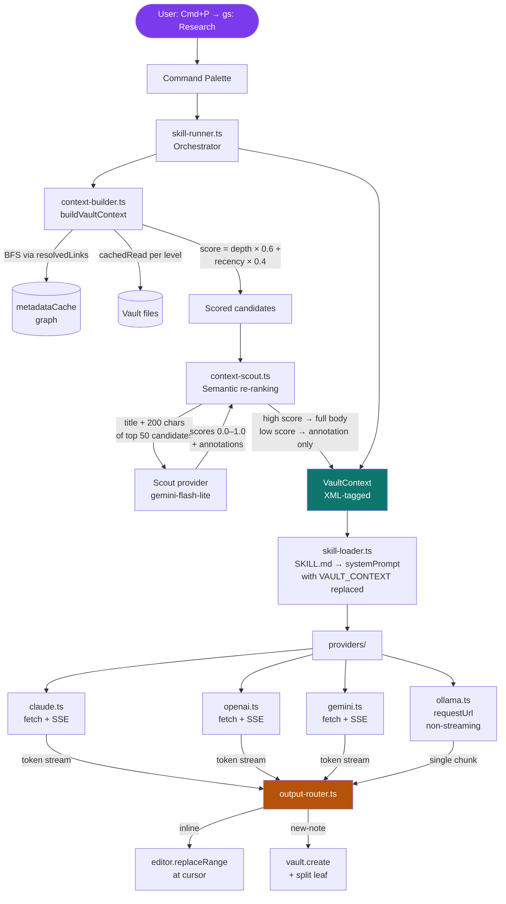

# obsidian-gstack

Vault-aware skill system for Obsidian. Run [gstack](https://github.com/garrytan/gstack) skills inside your vault — your linked notes become the context automatically.

Built by [Uves Arshad](https://x.com/uvesarshad) · [X](https://x.com/uvesarshad) · [LinkedIn](https://linkedin.com/in/uvesarshad)

---

## What it does

Open any note, hit `Cmd/Ctrl+P`, type `gs:` — and run a skill. The plugin walks your note graph, scores linked notes by relevance and recency, assembles them into a context window, and streams the output back into your note.

No copy-paste. No context switching. The AI already knows what you know.

**Built-in skills**

| Command | What it does |
|---|---|
| `gs: Research` | Synthesizes linked notes into a structured research brief |
| `gs: Campaign` | Turns product and audience notes into a full campaign plan |
| `gs: Plan` | Drafts a project or sprint plan from goals and context notes |
| `gs: Outline` | Builds a document outline from linked research |
| `gs: Review` | Editorial critique and improvement suggestions for the active note |

**Custom skills** — drop a `SKILL.md` file into `.gstack/skills/your-skill/` inside your vault and it registers as a live `gs:` command within 2 seconds. No restart, no code, no CLI required.

---

## Does this require the gstack CLI?

**No.** This plugin is fully standalone. You do not need to install the gstack CLI or Claude Code. Everything runs inside Obsidian using direct API calls to your chosen provider.

The plugin borrows gstack's `SKILL.md` format — the same human-readable skill definition files — but executes them itself using Obsidian's native APIs.

---

## Architecture



### Key design decisions

**No external LLM SDKs.** All provider calls use Obsidian's built-in `requestUrl()` (Ollama) or native `fetch()` (Claude, OpenAI, Gemini). `main.js` stays under 500 KB.

**Two-stage context pipeline.** BFS metadata scoring runs first (fast, no I/O). A cheap scout model then re-ranks the top 50 candidates semantically. If the scout times out or fails, execution continues with metadata scoring only.

**Per-note mutex.** Inline output to the same note is serialized. New-note output can run in parallel — separate targets, no conflict.

**SKILL.md format.** Each skill is a folder with one file. The folder name becomes the command. `{{VAULT_CONTEXT}}` is the only required placeholder. Custom skills hot-reload on save.

---

## Install

### Via BRAT (recommended for now)

1. Install [BRAT](https://github.com/TfTHacker/obsidian42-brat) from the Obsidian community plugins
2. In BRAT settings → Add Beta Plugin → paste this repo's URL
3. Enable **gstack** in Settings → Community Plugins

### Manual

1. Download `main.js`, `manifest.json`, `styles.css` from the latest [GitHub Release](../../releases)
2. Copy to `.obsidian/plugins/obsidian-gstack/` in your vault
3. Enable the plugin in Settings → Community Plugins

---

## Setup

1. Go to **Settings → gstack**
2. Choose your AI provider (Claude, OpenAI, Gemini, or Ollama)
3. Paste your API key
4. Open a note with linked notes and run `gs: Research`

Supported providers:

| Provider | Default model | Key required |
|---|---|---|
| Claude | claude-sonnet-4-6 | Yes — [anthropic.com/api](https://anthropic.com/api) |
| OpenAI | gpt-4o | Yes — [platform.openai.com/api-keys](https://platform.openai.com/api-keys) |
| Gemini | gemini-2.0-flash | Yes — [aistudio.google.com](https://aistudio.google.com) |
| Ollama | llama3.2 | No — runs locally |

> **Security:** API keys are stored in plaintext in your vault's `data.json`. Do not sync this vault to untrusted services or share it publicly.

---

## Writing skills in your vault

Skills live inside your vault — no CLI, no code editor required. The plugin watches the `.gstack/skills/` folder and registers every valid `SKILL.md` as a `gs:` command automatically.

### Folder structure

```
YourVault/
└── .gstack/
    └── skills/
        ├── competitor-analysis/
        │   └── SKILL.md
        ├── weekly-review/
        │   └── SKILL.md
        └── pitch-deck/
            └── SKILL.md
```

Each subfolder becomes one command. The folder name is used as the command slug.

### SKILL.md format

```markdown
---
name: competitor-analysis
description: Summarise competitor notes into a structured comparison
output: inline
max_depth: 3
max_tokens: 6000
---

You are a senior product strategist. The user's competitor research notes are below.

{{VAULT_CONTEXT}}

Produce a structured competitor analysis with:
- A comparison table (player, positioning, pricing, strengths, weaknesses)
- Key strategic gaps you can exploit
- One-paragraph recommendation

Only use facts from the notes. Do not invent data.
```

Save the file. The command `gs: Competitor Analysis` appears in the palette within 2 seconds.

### SKILL.md fields

| Field | Required | Default | Description |
|---|---|---|---|
| `name` | yes | — | Command slug — lowercase, hyphen-separated. Must be unique. |
| `description` | yes | — | Shown below the command name in the palette |
| `output` | no | global setting | `inline` inserts at cursor · `new-note` creates a linked note |
| `max_depth` | no | `3` | How many link-hops to walk from the active note (max 5) |
| `max_tokens` | no | global setting | Token budget for linked notes (active note always included in full) |

### The `{{VAULT_CONTEXT}}` placeholder

This is where your vault notes are injected. The plugin replaces it with an XML-structured block:

```xml
<active-note title="Q3 Product Launch">
[full content of the note you're in]
</active-note>

<context title="Customer Interviews" score="0.91" depth="1" annotation="Scout: highly relevant — contains ICP data">
[full content]
</context>

<context title="Old Competitor Notes" score="0.23" depth="2" annotation="Scout: low relevance — outdated 2023 data" summary-only="true">
Scout: low relevance — outdated 2023 data
</context>
```

High-scored notes (≥ 0.5) are included in full. Low-scored notes appear as their annotation only, preserving signal without burning tokens.

If your skill body has no `{{VAULT_CONTEXT}}`, it runs as a plain prompt — the plugin logs a warning to the developer console but does not block execution.

### Output modes

**`output: inline`** — tokens stream into the active note at your cursor position in real time.

**`output: new-note`** — a new note is created in the same folder as the active note, named `[Active Note] — [Skill Name].md`, and opened in a split pane. The skill output streams into it.

The `output:` field in `SKILL.md` overrides the global default in Settings → gstack → Default output mode.

### Name collisions

If a custom skill has the same `name` as a built-in skill (`research`, `campaign`, `plan`, `outline`, `review`), the custom skill is skipped and an Obsidian notice is shown. Rename the custom skill's `name` field to resolve it.

---

## Context assembly

When you run a skill, the plugin:

1. **BFS traversal** — walks forward links from the active note up to `max_depth` hops, capping at 200 nodes
2. **Metadata scoring** — scores each candidate: `(1/depth) × 0.6 + recency_decay × 0.4`
3. **Context Scout** *(optional, default on)* — a fast model reads the title + first 200 characters of the top 50 candidates and returns relevance scores (0–1) and a one-line annotation per note
4. **Budget enforcement** — notes are accumulated in score order until the token budget is exhausted; whole files are dropped, never truncated
5. **Context format** — assembled as XML-tagged blocks, high-scored notes in full, low-scored notes as annotation only

The active note is always included in full regardless of budget.

---

## Settings

| Setting | Default | Description |
|---|---|---|
| Provider | claude | AI service |
| Model | (provider default) | Leave blank to use the provider default |
| Ollama host | http://localhost:11434 | Only shown when Ollama is selected |
| Token budget | 6000 | Tokens of linked notes to include (1000–16000) |
| Context Scout | on | Semantic re-ranking before main model runs |
| Scout model | gemini-2.0-flash-lite | Model used for relevance scoring |
| Context decay | 14 days | Notes older than this are down-scored |
| Default output | inline | `inline` (at cursor) or `new-note` (split leaf) |

---

## Development

```bash
npm install
npm run dev        # watch mode — rebuilds on save
npm test           # 51 unit tests
npm run build      # production bundle → main.js
```

**Stack:** TypeScript · esbuild · Vitest · Obsidian Plugin SDK

To test against a real vault: copy or symlink the repo into `.obsidian/plugins/obsidian-gstack/` and enable the plugin. `npm run dev` rebuilds on save; reload with `Ctrl+R` in Obsidian (or via the BRAT hot-reload shortcut).

---

## License

MIT

---

*Built by [Uves Arshad](https://x.com/uvesarshad) — [X](https://x.com/uvesarshad) · [LinkedIn](https://linkedin.com/in/uvesarshad)*
